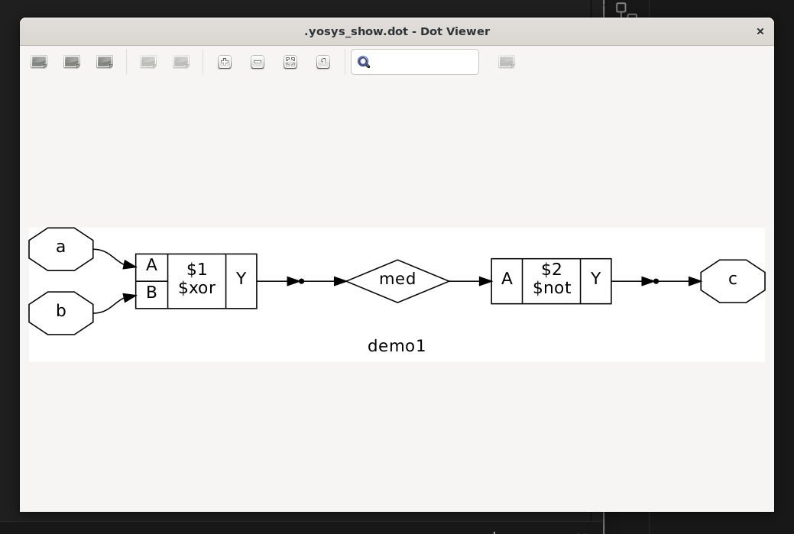
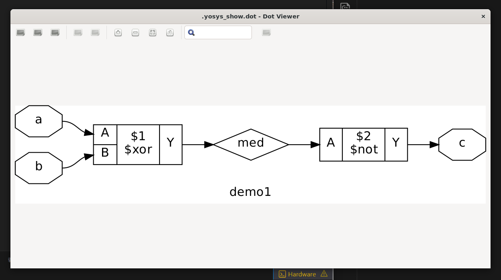

# Yosys 简单上手

开源综合工具

## 1.简单使用

[参考链接(yosys官方文档)](https://yosyshq.readthedocs.io/projects/yosys/en/latest/getting_started/example_synth.html#flattening)

安装好后输入yosys进入交互界面，对于命令，可以使用<kbd>Tab</kbd>键进行补全。

```bash
yosys> 
```
加载verilog文件
```bash
read_verilog <filename>
```

hierarchy命令，处理和层次结构相关的问题
如果使用了hierarchy命令制定了top，会自动发现找到使用的子模块，如果某个模块没有使用会自动删除，这时如果尝试使用read_verilog命令加载，但是重复加载了会报错退出。

给出检查层次结构和指定top的命令:
```bash
hierarchy -check -top <top>
```

可以使用show来查看节点图
例如:
```verilog
// demo1.v
module demo1(
    input a,
    input b,
    output c
);

wire med;
assign med = a ^ b ;
assign c = ~med;

endmodule
```
在终端中
```bash
yosys demo1.v
hierarchy -check -top demo1
show demo1
```
可以看到如下的网表图


进行优化
```bash
opt_clean
```
输出如下：
```bash
8. Executing OPT_CLEAN pass (remove unused cells and wires).
Finding unused cells or wires in module \demo1..
Removed 0 unused cells and 2 unused wires.
<suppressed ~1 debug messages>
```
可以看到消除了两条没用到的连线
网表图如下：


## 2.介绍官方Demo

文档链接见上参考链接。

这是一个在ice40 FPGA平台上创作的教程，但是指令和脚本很多都是通用的，因此无论是哪种架构，都可以学习调用的命令和他们所作的操作。

这里给出一个示例设计，用于接下来我们的操作

### 2.0 官方示例代码
```verilog
// 地址生成器/计数器
module addr_gen 
#(  parameter MAX_DATA=256,
	localparam AWIDTH = $clog2(MAX_DATA)
) ( input en, clk, rst,
	output reg [AWIDTH-1:0] addr
);
	initial addr <= 0;

	// 异步复位
	// 如果使能就增加地址
	always @(posedge clk or posedge rst)
		if (rst)
			addr <= 0;
		else if (en) begin
			if (addr == MAX_DATA-1)
				addr <= 0;
			else
				addr <= addr + 1;
		end
endmodule //addr_gen

// 定义了顶层的fifo实体
module fifo 
#(  parameter MAX_DATA=256,
	localparam AWIDTH = $clog2(MAX_DATA)
) ( input wen, ren, clk, rst,
	input [7:0] wdata,
	output reg [7:0] rdata,
	output reg [AWIDTH:0] count
);
	// fifo storage
	// sync read before write
	wire [AWIDTH-1:0] waddr, raddr;
	reg [7:0] data [MAX_DATA-1:0];
	always @(posedge clk) begin
		if (wen)
			data[waddr] <= wdata;
		rdata <= data[raddr];
	end // storage

	// addr_gen for both write and read addresses
	addr_gen #(.MAX_DATA(MAX_DATA))
	fifo_writer (
		.en     (wen),
		.clk    (clk),
		.rst    (rst),
		.addr   (waddr)
	);

	addr_gen #(.MAX_DATA(MAX_DATA))
	fifo_reader (
		.en     (ren),
		.clk    (clk),
		.rst    (rst),
		.addr   (raddr)
	);

	// status signals
	initial count <= 0;

	always @(posedge clk or posedge rst) begin
		if (rst)
			count <= 0;
		else if (wen && !ren)
			count <= count + 1;
		else if (ren && !wen)
			count <= count - 1;
	end

endmodule

```

### 2.1 加载设计
首先还是要先加载设计
```sh
yosys fifo.v
```

```sh-output

 /----------------------------------------------------------------------------\
 |  yosys -- Yosys Open SYnthesis Suite                                       |
 |  Copyright (C) 2012 - 2024  Claire Xenia Wolf <claire@yosyshq.com>         |
 |  Distributed under an ISC-like license, type "license" to see terms        |
 \----------------------------------------------------------------------------/
 Yosys 0.40+50 (git sha1 0f9ee20ea, clang++ 17.0.6 -fPIC -Os)

-- Parsing `fifo.v' using frontend ` -vlog2k' --

1. Executing Verilog-2005 frontend: fifo.v
Parsing Verilog input from `fifo.v' to AST representation.
Storing AST representation for module `$abstract\addr_gen'.
Storing AST representation for module `$abstract\fifo'.
Successfully finished Verilog frontend.
```
已经将其转换为了AST树也就是抽象语法树


### 2.2 解析展开(Elaboration)

我们已经进入了交互式终端，可以直接调用Yosys的命令  
我们的目的是调用`synth_ice40 -top fifo`不过我们来单独调用各个命令来学习每个部分是如何进行整个工作流的  
我们将从简单的部分也就是`addr_gen`开始

使用`help synth_ice40`可以查看这条指令由许多指令组合而成  
我们先从标注为`begin`的段落开始

##### `begin`段落
```sh
read_verilog -D ICE40_HX -lib -specify +/ice40/cells_sim.v
hierarchy -check -top <top>
proc
```

第一句加载了ice40的单元模型，使我们能够导入平台特定的IP  
例如PLL，在我们使用的时候可能需要使用`SB_PLL40_CORE`而不是在综合映射阶段采才去使用。  
不过我们的设计也没有使用任何IP块，因此可以跳过这句指令。但是在后续的映射阶段仍然需要导入。

> 提示  
> +/是一个对Yosys的share目录的动态引用，一般是`/usr/local/share/yosys`

#### 2.2.1 addr_gen模块
我们先从`addr_gen`模块开始，从`hierarchy -top addr_gen`这条指令开始  
其中addr_gen的代码[见上](#20-官方示例代码)
